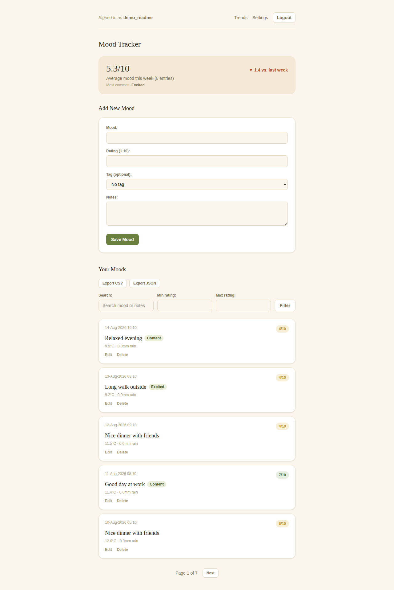
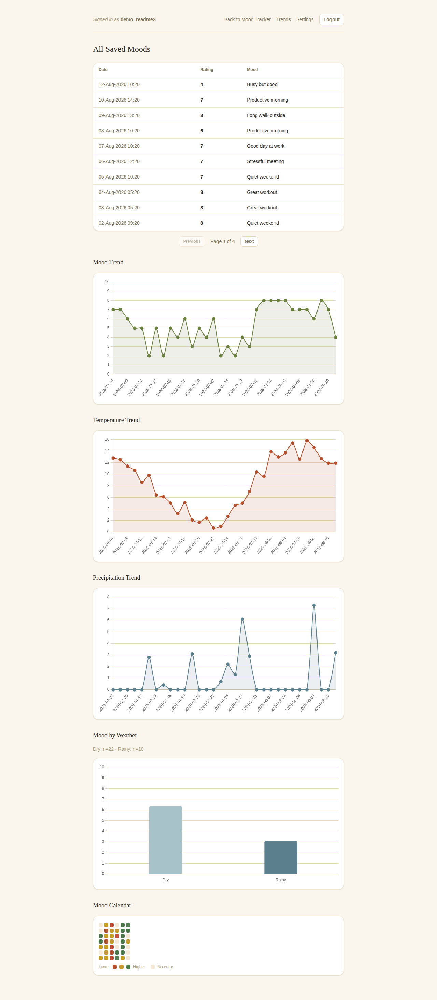
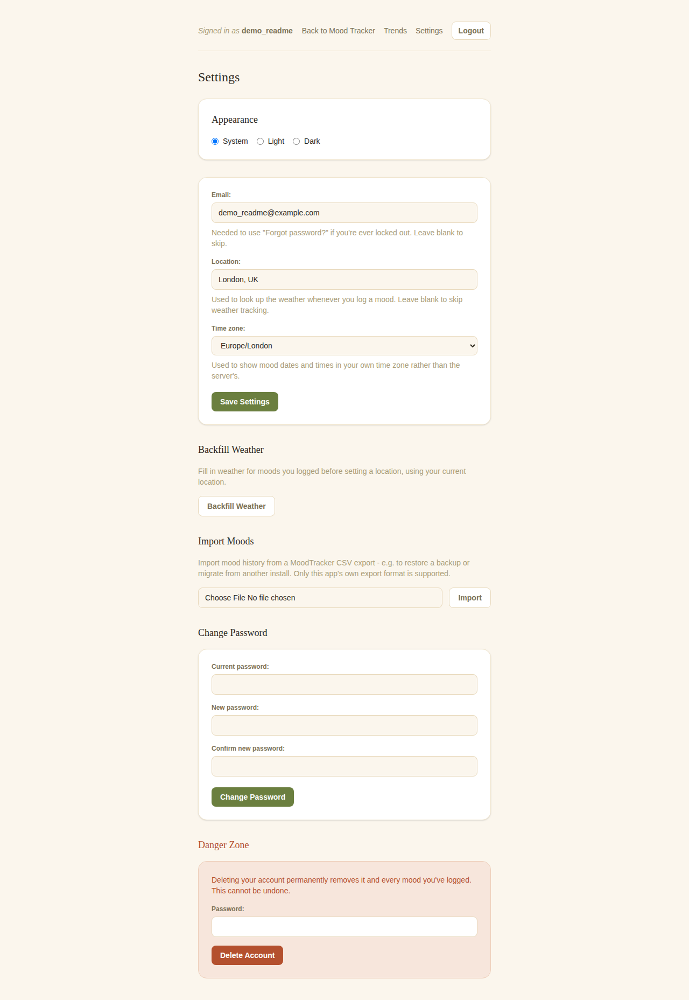
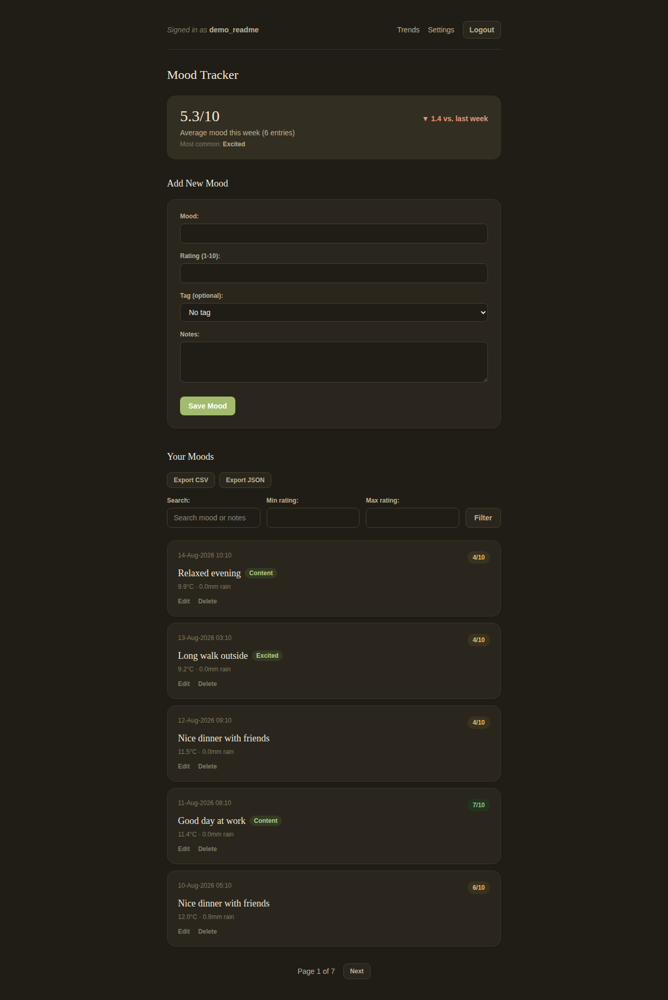

# MoodTracker

[](https://github.com/fxya/MoodTracker/actions/workflows/ci.yml)

A personal mood-tracking web app. Log a mood with a 1-10 rating and notes, and
MoodTracker automatically saves the local weather (temperature and
precipitation) alongside it, so you can look back and see whether the two
tend to line up. Built with Spring Boot and secured with Spring Security -
every user only ever sees their own data.

## Features

**Mood logging**
- Record a mood with a 1-10 rating, an optional quick-select tag (Happy,
  Sad, Anxious, Calm, Excited, Angry, Tired, Content), and free-text notes.
- Edit or delete any past entry - editing covers the mood text, rating,
  tag, and notes.
- Search mood history by text (mood or notes) and filter by rating range,
  with pagination.
- A weekly summary card shows your average rating for the past 7 days, how
  it compares to the week before, and your most common tag this week.

**Weather**
- Set a location under Settings, and current weather at that location is
  looked up and saved automatically with every mood you log, via
  [Open-Meteo](https://open-meteo.com/) (free, no API key required).
- Weather is shown inline on each mood entry, and can be corrected by hand
  from the edit form if the auto-fetched value is wrong (e.g. you were
  traveling).
- If weather lookup fails or no location is set, the mood still saves -
  weather is a bonus, never a blocker.
- Geocoded coordinates for a location are cached for a week, so logging
  moods doesn't re-geocode the same place every time.
- Backfill weather for moods logged before you set a location, from
  Settings - it looks up each missing day's historical conditions for
  your current location.

**Trends** (on the `/moods` page)
- Mood rating over time.
- Temperature and precipitation over time.
- Average mood on dry days vs. rainy days.
- A GitHub-style calendar heatmap of daily average mood, at a glance across
  weeks/months.
- Every chart has an accessible, screen-reader-friendly data table alongside
  it, since a `<canvas>` chart has no text content of its own.

**Export & import**
- Download your full mood history as CSV or JSON from the mood tracker
  page.
- Import mood history from a MoodTracker CSV export, to restore a backup or
  migrate from another install.

**Appearance**
- Switch between light, dark, and system theme from Settings - the choice
  is remembered per browser.
- Installable as a PWA ("Add to Home Screen" on mobile or desktop Chrome):
  has an app icon/manifest and a service worker that caches the static app
  shell for faster repeat loads. Mood data itself always comes from the
  server, not a cache, so it's never stale or usable fully offline.

**Account**
- Register and log in; all data is scoped to your own account.
- Optionally set your time zone in Settings so mood dates/times display in
  your own zone instead of the server's.
- Change your password or delete your account (and everything in it)
  from Settings.
- Reset a forgotten password via email - see "Forgot password" below.

## Screenshots

**Mood Tracker** - log a mood with a rating and optional tag, see this
week's summary, and browse/search/export past entries:



**Trends** - mood, temperature, and precipitation over time, mood by
weather, and the mood calendar heatmap:



**Settings** - appearance, account, weather backfill, CSV import, and
account management:



**Dark mode**:



## Health check

`GET /actuator/health` is reachable without authentication and returns a bare
`{"status":"UP"}` (or `"DOWN"` if the database is unreachable) - useful for a
monitoring script, cron job, or container healthcheck against a Pi-hosted
instance, and is what the Dockerfile's `HEALTHCHECK` directive polls (see
"Docker" below). Nothing else under `/actuator` is exposed - no metrics, env,
beans, etc. - only the liveness/readiness signal.

## Forgot password

Set an email address at registration (or later, under Settings) to enable
"Forgot your password?" on the login page. It emails a link, valid for 30
minutes, to set a new password.

This needs an SMTP relay to actually deliver mail - set these environment
variables when running somewhere real (e.g. with a Gmail app password, or
any other SMTP provider):
```bash
MAIL_HOST=smtp.example.com
MAIL_PORT=587
MAIL_USERNAME=your-smtp-username
MAIL_PASSWORD=your-smtp-password
MAIL_FROM=no-reply@yourdomain.com
```
With none of these set, the app still starts and the "Forgot your password?"
form still "succeeds" from the UI's point of view - by design, the request
always shows the same generic message regardless of whether an account was
found or an email was actually sent, to avoid leaking which usernames exist.
That means it's easy to forget SMTP isn't configured; check the server logs
for a "Failed to send password reset email" warning if a reset link never
arrives.

## Technology

- Java 21
- Spring Boot 4.1 (Spring Framework 7, Spring Security 7, Jackson 3)
- Spring Data JPA / Hibernate
- Thymeleaf
- PostgreSQL
- Tailwind CSS v4 + Vite (compiles `frontend/` into `src/main/resources/static`,
  wired into the Gradle build - see "Frontend build" below)
- Chart.js (an npm dependency bundled by Vite, not a CDN script)
- Progressive Web App: manifest + service worker, installable, caches the
  static app shell for faster repeat loads
- Apache Commons CSV for mood import (export is simple enough to hand-write)
- Open-Meteo for weather data
- Gradle
- Docker

## Running locally

**Prerequisites:** Java 21 and a running PostgreSQL instance. The included
`./gradlew` wrapper downloads a matching Gradle distribution automatically,
so a separate Gradle install isn't required.

1. Clone the repository and `cd` into it.
2. Create the database:
   ```bash
   createdb moodtracker
   ```
   (or `psql -c "CREATE DATABASE moodtracker;"`)
3. The datasource defaults in `src/main/resources/application.properties`
   assume PostgreSQL on `localhost:5432` with user `postgres`:
   ```properties
   spring.datasource.url=${DB_URL:jdbc:postgresql://localhost:5432/moodtracker}
   spring.datasource.username=${DB_USERNAME:postgres}
   spring.datasource.password=${DB_PASSWORD:your_postgres_password}
   ```
   If your local setup differs, either edit those defaults or set the
   `DB_URL` / `DB_USERNAME` / `DB_PASSWORD` environment variables - the same
   variables are how you'd override the committed placeholder credentials
   before running anywhere beyond your own machine. Tables are created
   automatically on first run via `schema.sql`, and Hibernate adds any new
   columns on top of that as the app evolves (`ddl-auto=update`).
4. Run the app:
   ```bash
   ./gradlew bootRun
   ```
5. Open `http://localhost:8080`, register an account, and log in. Set a
   location under Settings to start recording weather with your moods.

### Profiles

The `dev` Spring profile is active by default (see `spring.profiles.active` in
`application.properties`), which is what makes step 4 work with no further
setup: on first startup it seeds a demo account (`testuser` / `password`) -
handy for quickly poking around without registering, but not something to
rely on outside local development. Running with any other profile active
(`SPRING_PROFILES_ACTIVE=prod ./gradlew bootRun`, for example) skips that
seeding. A real deployment should set `SPRING_PROFILES_ACTIVE` to something
other than `dev`, in addition to overriding the database credentials above.

### Login/registration rate limiting

`POST /login`, `POST /register`, and `POST /forgot-password` are rate-limited
per client IP (20 attempts per 5-minute window by default, in-memory, reset
on restart) to blunt naive automated credential-stuffing and
account-enumeration attempts. It's a single-instance, best-effort deterrent,
not a replacement for a proper WAF/gateway-level defense in a real
deployment. Both numbers are configurable via `APP_AUTH_RATE_LIMIT_MAX_ATTEMPTS`
/ `APP_AUTH_RATE_LIMIT_WINDOW_MINUTES` if 20/5min doesn't fit your setup (the
e2e suite raises this itself - see below).

### Frontend build

`src/main/resources/static/css/style.css` and `.../static/js/moods.js` are
**generated** - don't hand-edit them, edit their source under `frontend/`
instead (`frontend/css/app.css`, `frontend/js/`). The
[com.github.node-gradle.node](https://github.com/node-gradle/gradle-node-plugin)
plugin runs `npm run build` (Vite, with Tailwind CSS v4 via
`@tailwindcss/vite`) automatically before `processResources`, so
`./gradlew bootRun`/`build`/`test` always compile fresh frontend output with
no separate manual step - and no host Node install, since the plugin
downloads a pinned Node version into `.gradle/nodejs` the first time it's
needed. For iterating on frontend code alongside `bootRun`, `npm run dev`
(`vite build --watch`) pairs with Spring Boot DevTools' existing LiveReload,
which already watches `static/**` for changes.

## Running tests

```bash
./gradlew test
```

The test suite runs against a real local PostgreSQL instance - make sure one
is running and configured as described above before running tests.
`WeatherServiceTest` mocks the HTTP calls to Open-Meteo, so no network access
is needed for that part.

The pure JS logic behind the `/moods` charts (`frontend/js/mood-analysis.js`:
series building, dry/rainy bucketing, heatmap data) has its own small Vitest
suite:
```bash
npm install
npm test
```

### End-to-end tests

The `e2e/` suite drives a real Chromium browser against a real running app
(via [Playwright](https://playwright.dev/)), covering the actual user
journeys: register/login/logout, adding/editing/deleting/searching moods,
CSV/JSON export, and the settings flows (location/time zone, password
change, account deletion). It manages the app process itself
(`playwright.config.js`'s `webServer` runs `./gradlew bootRun` and waits for
it to be ready), so you only need Postgres already running, same as
`./gradlew test`:
```bash
npm install
npx playwright install --with-deps chromium   # first time only
npm run test:e2e
```
Weather/backfill is deliberately **not** covered here - those flows call a
real third-party API (Open-Meteo), and relying on it from e2e tests would
make the suite flaky and non-deterministic. That logic is already covered by
`WeatherServiceTest`/`SettingsControllerTest` with a mocked `WebClient`; e2e
tests simply never set a location, which is itself a real (if implicit)
check of the app's designed-in "weather is optional" degradation path.
Likewise, `forgot-password.spec.js` only covers the request form and an
invalid-token link - there's no way for Playwright to read a real email, so
the token-based reset itself is covered by `PasswordResetControllerTest`
instead.

Several tests in `e2e/mood-crud.spec.js` share one logged-in session across
tests (`test.describe.configure({ mode: 'serial' })`) rather than
registering/logging in fresh for every single test, to keep the suite's own
register/login volume down. `playwright.config.js` also raises
`APP_AUTH_RATE_LIMIT_MAX_ATTEMPTS` for its `webServer` process, since all e2e
traffic originates from the same machine/IP and would otherwise trip the
real per-IP limit described above - that's trusted local/CI traffic, not the
untrusted traffic the limit exists to blunt in production.

## Code style

Java follows the [Google Java Style Guide](https://google.github.io/styleguide/javaguide.html),
enforced via [Spotless](https://github.com/diffplug/spotless) with
[google-java-format](https://github.com/google/google-java-format):
```bash
./gradlew spotlessCheck   # fails the build on a style violation (also runs as part of `check`)
./gradlew spotlessApply   # reformats in place
```

JS/CSS under `frontend/` are formatted with [Prettier](https://prettier.io/)
(config in `.prettierrc.json`; kept single-quote and 4-space to match the
existing code rather than Prettier's bare defaults):
```bash
npm run format:check
npm run format
```
Thymeleaf templates are intentionally not auto-formatted - a generic HTML
formatter risks mangling `th:*` attribute syntax.

## Docker

1. Build the application JAR (this now also runs the frontend build - see
   "Frontend build" above - so it needs npm-registry access and, on the
   first run, a one-time Node download in addition to Maven Central):
   ```bash
   ./gradlew clean build
   ```
2. Build the image (this step itself has no new network dependency - it
   just copies the already-built jar):
   ```bash
   docker build -t moodtracker-app .
   ```
3. Run the container, pointing it at a reachable PostgreSQL instance. Add the
   `MAIL_*` variables too (see "Forgot password" above) if you want password
   resets to actually deliver mail - they're optional, the app runs fine
   without them:
   ```bash
   docker run -p 8080:8080 --name moodtracker \
     -e DB_URL=jdbc:postgresql://<host>:5432/moodtracker \
     -e DB_USERNAME=<username> \
     -e DB_PASSWORD=<password> \
     -e SPRING_PROFILES_ACTIVE=prod \
     -e MAIL_HOST=<smtp-host> \
     -e MAIL_USERNAME=<smtp-username> \
     -e MAIL_PASSWORD=<smtp-password> \
     -e MAIL_FROM=<from-address> \
     moodtracker-app
   ```

The container needs network access to that PostgreSQL database (`localhost`
won't resolve to the host machine from inside the container - use the host's
address, a linked container, or a managed database instead), and outbound
HTTPS access to Open-Meteo for weather lookups. No API key is required for
Open-Meteo.

The image has a `HEALTHCHECK` that polls `/actuator/health` (see "Health
check" above) every 30s, so `docker ps` shows `healthy`/`unhealthy` next to
the container once it's had time to start up. For the full status history:
```bash
docker inspect --format='{{.State.Health.Status}}' moodtracker
```

To stop and remove the container:
```bash
docker stop moodtracker
docker rm moodtracker
```

### Docker Compose

For a standing deployment (e.g. on a Raspberry Pi) `docker-compose.yml` is
easier to live with than the manual steps above - it runs the app and a
Postgres instance together, with a named volume for the database and a
restart policy so both come back up after a reboot or crash. Postgres has
its own healthcheck, and the app container's `depends_on` waits for it, so
there's no cold-start race against Postgres not being ready yet.

1. Copy the example env file and set a real Postgres password (everything
   else - SMTP for password-reset email, the host port - is optional; see
   the comments in the file):
   ```bash
   cp .env.example .env
   ```
2. Build and start both containers:
   ```bash
   docker compose up -d --build
   ```
   The app is served on port 80 by default - override with `APP_PORT` in
   `.env` if that's already taken on your host.
3. Check on it:
   ```bash
   docker compose ps        # shows health status for both containers
   docker compose logs -f app
   ```
4. Stop it (keeps the database volume), or tear down entirely:
   ```bash
   docker compose down       # stop and remove containers, keep the db volume
   docker compose down -v    # also delete the database volume - irreversible
   ```

### Reaching it at a local URL

Docker itself has no say in this - it's local name resolution. On a
Raspberry Pi, the simplest option costs nothing: Raspberry Pi OS ships with
Avahi/mDNS, so the Pi already answers to `<hostname>.local` on the LAN.
Rename it if you want something friendlier than the default
(`sudo raspi-config` → System Options → Hostname), then browse to
`http://<hostname>.local` (port 80 from the Compose setup above needs no
`:port` suffix). Give the Pi a static DHCP reservation in your router too,
so the mapping doesn't break if its IP changes. If you already run
Pi-hole, its **Local DNS Records** feature is a more consistently reliable
alternative across devices than mDNS.

One caveat: the app is installable as a PWA (see "Appearance" under
Features), which needs a secure context - HTTPS, or `localhost` specifically.
Plain `http://<hostname>.local` works fine for everything else, but browsers
will generally decline to register the service worker or offer an install
prompt over it. That's only relevant if you want the installable/offline-
shell behavior; getting HTTPS onto a LAN-only hostname means fronting the
app with a reverse proxy (e.g. Caddy) and a locally-trusted certificate,
which is its own separate step beyond what's covered here.
